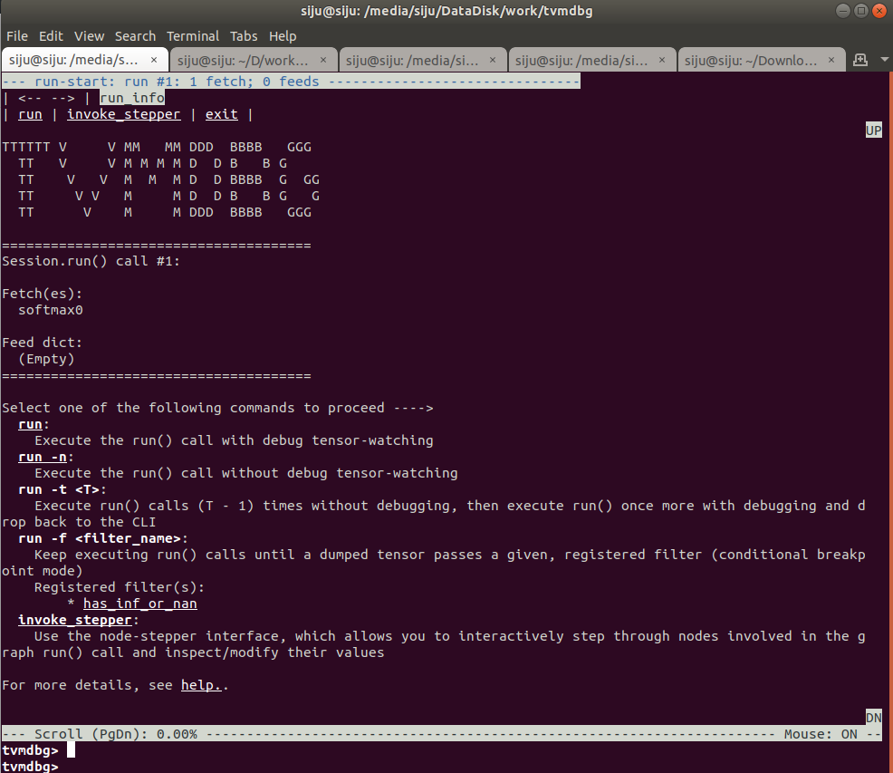
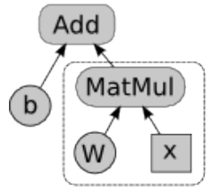
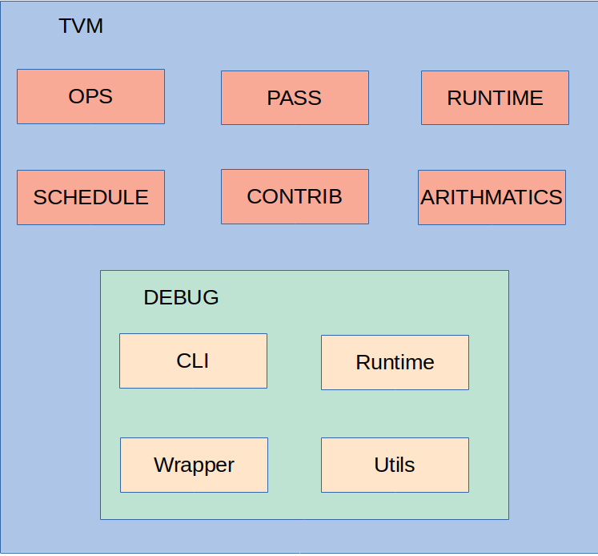
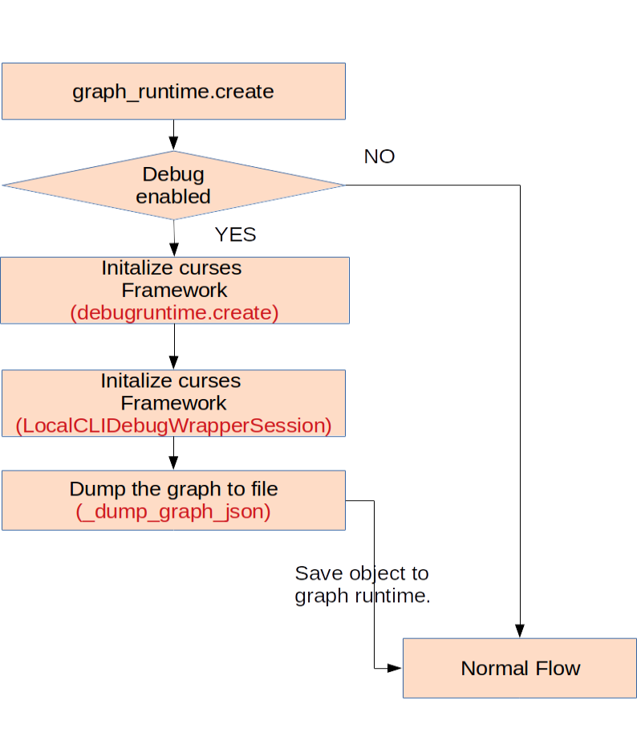
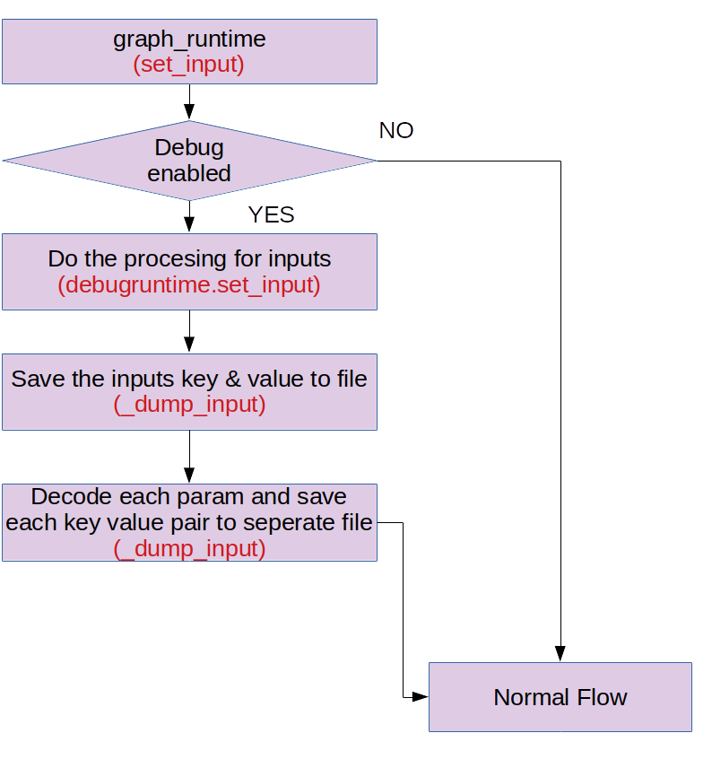
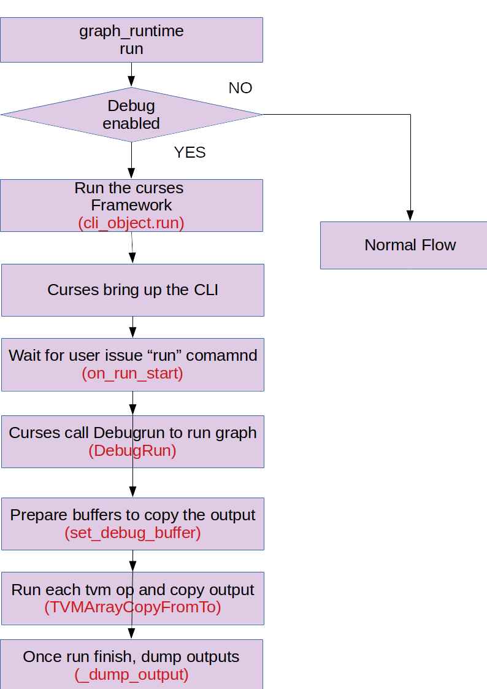

**TVMDBG**

TVM Debugger (TVMDBG) is a specialized debugger for TVM&#39;s computation graphs. It provides access to internal graph structures and tensor values at TVM runtime.

**Why**  **TVMDBG**

In TVM&#39;s current computation-graph framework, almost all actual computation after graph construction happens in a single Python function, namely [t](https://www.tensorflow.org/api_docs/python/tf/Session#run)vm.run. Basic Python debugging tools such as [pdb](https://docs.python.org/2/library/pdb.html)cannot be used to debug tvm.run, due to the fact that TVM&#39;s graph execution happens in the underlying C++ layer. C++ debugging tools such as [gdb](https://www.gnu.org/software/gdb/)are not ideal either, because of their inability to recognize and organize the stack frames and variables in a way relevant to TVM&#39;s operations, tensors and other graph constructs.

TVMDBG addresses these limitations. Among the features provided by TVMDBG, the following ones are designed to facilitate runtime debugging of TVM models:

- Easy access through session wrappers
- Inspection of runtime tensor values and node connections
- Conditional breaking after runs that generate tensors satisfying given predicates, which makes common debugging tasks such as tracing the origin of infinities and [NaNs](https://en.wikipedia.org/wiki/NaN)easier
- Association of nodes and Submodules of tensors in graphs with Python source lines

**How to use TVM?**

- TVMDBG command-line interface
- For programmatic use of the API of TVMDBG

This guide focuses on the command-line interface (CLI) of tvmdbg.

**Note:** The TVM debugger uses a curses-based text user interface. On Mac OS X, the **ncurses** library is required and can be installed with **brew install homebrew/dupes/ncurses**. On Windows, curses isn&#39;t as well supported, so a readline-based interface can be used with tfdbg by installing **pyreadline** with **pip**. If you use Anaconda3, you can install it with a command such as **&quot;C:\Program Files\Anaconda3\Scripts\pip.exe&quot; install pyreadline**. Unofficial Windows curses packages can be downloaded here, then subsequently installed using **pip install &lt;your\_version&gt;.whl** , however curses on Windows may not work as reliably as curses on Linux or Mac.
  
This tutorial demonstrates how to use the **tvmdbg** CLI to debug the appearance of [**nan**](https://en.wikipedia.org/wiki/NaN) [s](https://en.wikipedia.org/wiki/NaN) and [**inf**](https://en.wikipedia.org/wiki/Infinity) [s](https://en.wikipedia.org/wiki/Infinity), a frequently-encountered type of bug in TVM model development.

The interface of tvmdbg looks like below.
 
 
 TBD >> ADD CLI information here
 
 
     
 An example dataflow graph in NNVM. Nodes Add and MatMul are computation nodes. W and b are Variables. x is an Placeholder node. The dashed box provides an example for tvmdbg NodeStepper’s stepping through a graph. Suppose the nodes in the dashed box have been executed in a previous continue call, a subsequent continue call on the Add node need not recompute those nodes, but can use the cached tensor for the MatMul node. 


**Design of TVMDBG**

**TVMDBG in TVM**

The above picture shows the debug module in TVM. TVMDBG consists of runtime, cli, wrapper and utils.

**Runtime**
  Runtime interfaces with the graph runtime. Runtime comes into play when the debugging functionality is enabled while creating the graphruntime.
  
**Cli**
  CLI module is the core part of the curses module. This includes the UI framework, formatting of data, getting user inputs, etc.
  
**Wrapper**
  Wrapper.. blah blah
  
**Utils**
  Utility functions for TVMDBG submodule.

TVMDBG mainly consits of 3 functionalities.
1. Analyzer
2. Runner
3. Stepper

**Analyzer**
The Analyzer adds observability to the graph execution process. It makes the structure and intermediate state of the runtime graph visible. Analyzer mainly contains 3 parts
1. Node information
2. List Tensors
3. Print Layers

**Runner**
  A type of frequently encountered problem in TVM is bad numerical values, e.g., infinities and NaNs, which arise due to various reasons such as numerical overflow and underflow, logarithm of and division by zero. In a large ML model with thousands of nodes, it can be hard to find the node at which this first emerged and started propagating through the graph. With tvmdbg, the user can specify a breaking predicate in the Stepper to let runs break when any intermediate tensors in the model first show infinities or NaNs and drop into the Analyzer UI to identify the first-offending node. By examining the type of node and its inputs using the Analyzer UI, the user can obtain useful information about why these values occur, which often leads to a fix to the issue such as applying value clipping to the problematic node.

**Stepper**
 blah-blah

**Design of TVMDBG**

In tvm/contrib/graph_runtime.py debug flag is added. To enable the debugging session, developer can set the below debug flag when graph runtime is created.
```
#Create the graph run time
m = graph_runtime.create(graph, lib, ctx, debug=True)

# set inputs
m.set_input('data', tvm.nd.array(data.astype(dtype)))
m.set_input(**params)

# execute
m.run()
```
The ```create``` interface in ```tvm/contrib/graph_runtime.py``` is modified to take the debug flag value.
All the debugging operation depends on this flag. If this flag is disabled, during runtime there is no influence of debugging. 
The debugging window will pop up open only when this flag is set.
The interface modification is shown as below.
```def create(graph_json_str, libmod, ctx, debug=False):
    """Create a runtime executor module given a graph and module.

    Parameters
    ----------
    graph_json_str : str or graph class
        The graph to be deployed in json format output by nnvm graph.
        The graph can only contain one operator(tvm_op) that
        points to the name of PackedFunc in the libmod.

    libmod : tvm.Module
        The module of the corresponding function

    ctx : TVMContext
        The context to deploy the module, can be local or remote.

    debug : bool
        To enable or disable the debugging

    Returns
    -------
    graph_module : GraphModule
        Runtime graph module that can be used to execute the graph.
    """
```
**Flow diagrams**
**1. Create runtime**

TVMDBG will comes into play only if the debug flag is enabled in tvmdbg. This flow initializes the debug module and curses module. It decodes the graph passed during creating the runtime and dumps this information to a file in a structured way so that it can be used later by the CLI framework for listing nodes and showing the node details. Argument and operations are saved to json file with all the necessary details like shape, attributes, operation name, etc. The size of output buffers is calculated here from the input graph and its saved to the runtime object, which is used later for collecting the outputs of each layers.

**2. Set inputs**

If the debug is enabled, then all the inputs set, either its a key-value pair or params, will be dumped to file in numpy format. This will be later loaded by CLI framework to show the tensor information.

**3. Run graph**

Run is the core of the tvmdbg module. When the graphtime run is invoked, if debug is not enabled, it will take its normal path of running and will get the output. Otherwise, the CLI framework will be shown to user during this time. Here user will have different options to perform. User can do actual run and see the tensors or do stepping functions from this CLI interface. When user invokes the "run" from CLI, DebugRun will be invoked and memory will be made for the output buffers.
This memory will be set to the c++ object where actual opertions will be performed. Once the execution of each operation is completed, the output will be copied to the memory which was created earlier. Once all the operation execution is completed, the time taken for each operation and output is dumped into a temporary folder which can be used by CLI module.

**Issues:**
1. Can dump only fused graph.
2. Layer information will be dispersed into multiple operators.

**Use Cases**
**White-box Testing of ML Models.** In an ML system under active development, feature development and code refactoring can sometimes lead to unforeseen changes in the structure and behavior of an ML model. Such changes can also arise as a result of changes in the underlying ML library itself. If left untested, these low-level changes can lead to subtle issues in production that are difficult to observe and debug. The above-described Analyzer module of tvmdbg makes it possible to make assertions about a model in unit tests.

Two types of assertions can be made based on tvmdbg&#39;s Analyzer:

1) Structural assertions: The structure of a NNVM graph, the nodes and their attributes

2) Functional assertions: The intermediate tensor values in the graph under a given set of inputs. Structural and functional assertions should focus on the critical parts of the model, such as output of a neural-network layer or an embedding lookup result, and ignore noncritical parts, in order to avoid being sensitive to unimportant changes caused by refactoring or library changes.

**Debugging Problematic Numerical Values.** A type of frequently encountered problem in  ML model training/inference is bad numerical values, e.g., **infinities and NaNs** , which arise due to various reasons such as numerical overflow and underflow, logarithm of and division by zero. In a large ML model with thousands of nodes, it can be hard to find the node at which this first emerged and started propagating through the graph. With tvmdbg, the user can specify a breaking predicate in the RunStepper to let runs break when any intermediate tensors in the model first show infinities or NaNs and drop into the Analyzer UI to identify the first-offending node. By examining the type of node and its inputs using the Analyzer UI, the user can obtain useful information about why these values occur, which often leads to a fix to the issue such as applying value clipping to the problematic node.

**Directory Structure of TVM**
├── apps
├── docs
├── include
├── jvm
├── make
├── python
│   ├── conda
│   └── tvm
│       ├── contrib
│       ├── exec
│       ├── \_ffi
│       └── tools
│           ├── debug
│           │    ├── cli
│           │    ├── runtime
│           │    ├── util
│           │    └── wrappers
│           └── profiler
├── sgx
├── src
│   ├── api
│   ├── arithmetic
│   ├── codegen
│   ├── common
│   ├── contrib
│   ├── lang
│   ├── op
│   ├── pass
│   ├── runtime
│   ├── tools
│   │   ├── debug
│   │   └── profiler
│   └── schedule
├── tests
│   ├── ci\_build
│   ├── cpp
│   ├── lint
│   ├── python
│   ├── scripts
│   ├── travis
│   ├── verilog
│   ├── web
│   └── webgl
└── topi
